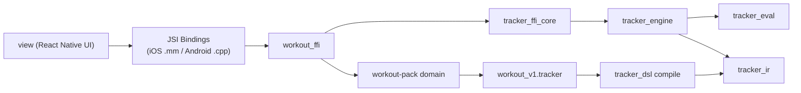

# Architecture

This repository is split into three primary layers:

- `strata/`: generic deterministic tracker core (domain-agnostic)
- `workout-pack/`: workout domain pack (DSL + domain orchestration)
- `view/`: React Native UI and local app orchestration

## Data Flow



## Boundaries

- Core engine behavior is pure and deterministic.
- Domain-specific behavior lives in pack modules and DSL.
- UI remains a thin shell: render + persistence + interaction.

## Contract Generation

`workout-pack/build.rs` generates TS contracts consumed by `view`:

- `view/src/domain/generated/workoutDslContract.ts`
- `view/src/domain/generated/workoutApiContract.ts`
- `view/src/domain/generated/workoutDomainContract.ts`

Regenerate with:

```sh
just pack-sync-dsl-contract
```

## Purity Rules

- `strata` must not import from downstream modules (`workout-pack`, `view`).
- `strata` must not contain workout-specific terms in code paths.

Validation:

```sh
just strata-purity
just sot-check
```
